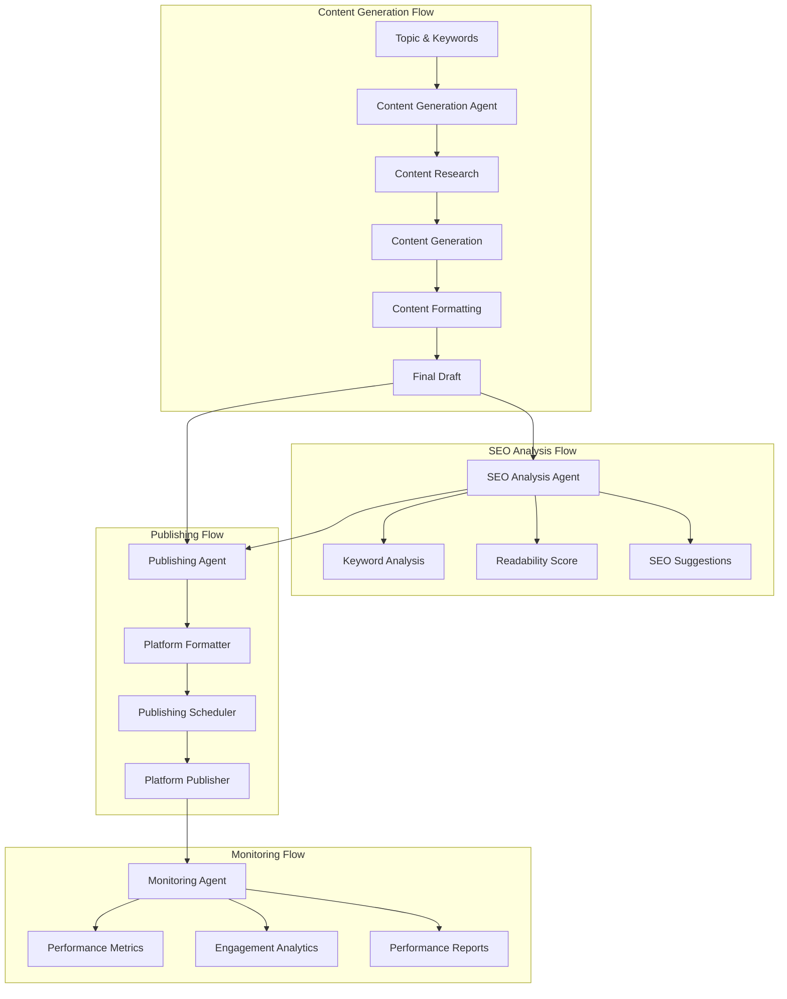
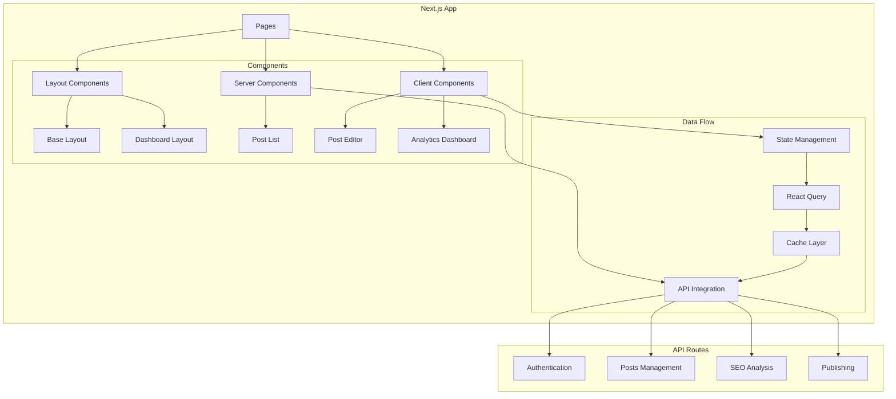
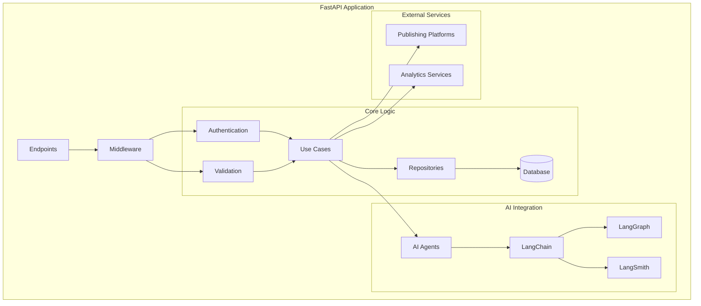
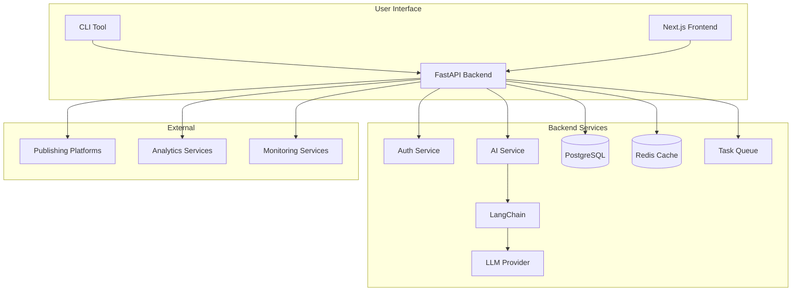
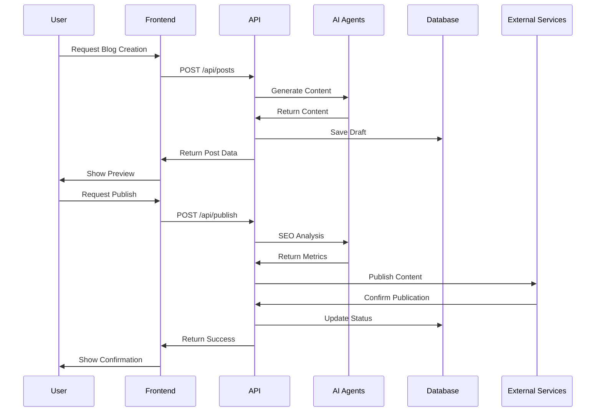

# Architecture Diagrams

## AI Agent Architecture

```mermaid
graph TD
    subgraph Content Generation Flow
        T[Topic & Keywords] --> CGA[Content Generation Agent]
        CGA --> CR[Content Research]
        CR --> CG[Content Generation]
        CG --> CF[Content Formatting]
        CF --> FD[Final Draft]
    end

    subgraph SEO Analysis Flow
        FD --> SEO[SEO Analysis Agent]
        SEO --> KA[Keyword Analysis]
        SEO --> RS[Readability Score]
        SEO --> SG[SEO Suggestions]
    end

    subgraph Publishing Flow
        FD --> PA[Publishing Agent]
        SEO --> PA
        PA --> PF[Platform Formatter]
        PF --> PS[Publishing Scheduler]
        PS --> PP[Platform Publisher]
    end

    subgraph Monitoring Flow
        PP --> MA[Monitoring Agent]
        MA --> PM[Performance Metrics]
        MA --> EA[Engagement Analytics]
        MA --> PR[Performance Reports]
    end
```

## Frontend Architecture

```mermaid
graph TD
    subgraph Next.js App
        PG[Pages] --> LC[Layout Components]
        PG --> SC[Server Components]
        PG --> CC[Client Components]

        SC --> API[API Integration]
        CC --> SM[State Management]

        subgraph Components
            LC --> Base[Base Layout]
            LC --> Dashboard[Dashboard Layout]
            SC --> PostList[Post List]
            CC --> Editor[Post Editor]
            CC --> Analytics[Analytics Dashboard]
        end

        subgraph Data Flow
            SM --> Query[React Query]
            Query --> Cache[Cache Layer]
            Cache --> API
        end
    end

    subgraph API Routes
        API --> Auth[Authentication]
        API --> Posts[Posts Management]
        API --> SEO[SEO Analysis]
        API --> Publish[Publishing]
    end
```

## API Architecture

```mermaid
graph TD
    subgraph FastAPI Application
        EP[Endpoints] --> MW[Middleware]
        MW --> Auth[Authentication]
        MW --> Val[Validation]

        subgraph Core Logic
            Auth --> UC[Use Cases]
            Val --> UC
            UC --> Repo[Repositories]
            Repo --> DB[(Database)]
        end

        subgraph AI Integration
            UC --> AI[AI Agents]
            AI --> LC[LangChain]
            LC --> LG[LangGraph]
            LC --> LS[LangSmith]
        end

        subgraph External Services
            UC --> Pub[Publishing Platforms]
            UC --> Ana[Analytics Services]
        end
    end
```

## System Integration

```mermaid
graph TD
    subgraph User Interface
        CLI[CLI Tool] --> API
        Web[Next.js Frontend] --> API
    end

    subgraph Backend Services
        API[FastAPI Backend] --> Auth[Auth Service]
        API --> AI[AI Service]
        API --> DB[(PostgreSQL)]

        AI --> LC[LangChain]
        LC --> LLM[LLM Provider]

        API --> Cache[(Redis Cache)]
        API --> Queue[Task Queue]
    end

    subgraph External
        API --> Pub[Publishing Platforms]
        API --> Ana[Analytics Services]
        API --> Mon[Monitoring Services]
    end
```

## Data Flow

```mermaid
sequenceDiagram
    participant U as User
    participant F as Frontend
    participant A as API
    participant AI as AI Agents
    participant DB as Database
    participant E as External Services

    U->>F: Request Blog Creation
    F->>A: POST /api/posts
    A->>AI: Generate Content
    AI->>A: Return Content
    A->>DB: Save Draft
    A->>F: Return Post Data
    F->>U: Show Preview

    U->>F: Request Publish
    F->>A: POST /api/publish
    A->>AI: SEO Analysis
    AI->>A: Return Metrics
    A->>E: Publish Content
    E->>A: Confirm Publication
    A->>DB: Update Status
    A->>F: Return Success
    F->>U: Show Confirmation
```
