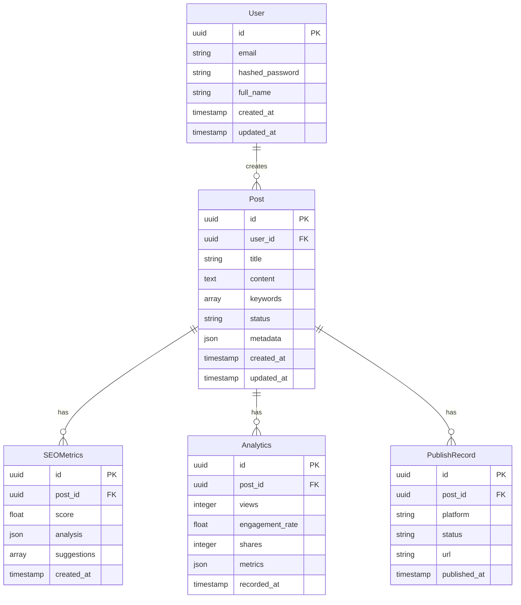

# Database Schema Documentation

## Overview



## SQLAlchemy Models

```python
# app/models/user.py
from sqlalchemy import Column, String, DateTime
from sqlalchemy.orm import relationship
from app.db.base import Base

class User(Base):
    __tablename__ = "users"

    id = Column(UUID(as_uuid=True), primary_key=True, default=uuid.uuid4)
    email = Column(String, unique=True, index=True, nullable=False)
    hashed_password = Column(String, nullable=False)
    full_name = Column(String)
    created_at = Column(DateTime, default=datetime.utcnow)
    updated_at = Column(DateTime, default=datetime.utcnow, onupdate=datetime.utcnow)

    posts = relationship("Post", back_populates="author")
```

## Migrations

```python
# alembic/versions/001_initial.py
"""initial

Revision ID: 001
Revises:
Create Date: 2024-03-20 10:00:00.000000

"""
from alembic import op
import sqlalchemy as sa

def upgrade():
    op.create_table(
        'users',
        sa.Column('id', sa.UUID(), nullable=False),
        sa.Column('email', sa.String(), nullable=False),
        sa.Column('hashed_password', sa.String(), nullable=False),
        sa.Column('full_name', sa.String()),
        sa.Column('created_at', sa.DateTime(), nullable=False),
        sa.Column('updated_at', sa.DateTime(), nullable=False),
        sa.PrimaryKeyConstraint('id'),
        sa.UniqueConstraint('email')
    )
    # ... additional tables
```

## Database Configuration

```python
# app/core/config.py
from pydantic_settings import BaseSettings

class DatabaseSettings(BaseSettings):
    POSTGRES_SERVER: str
    POSTGRES_USER: str
    POSTGRES_PASSWORD: str
    POSTGRES_DB: str
    SQLALCHEMY_DATABASE_URI: Optional[str] = None

    @validator("SQLALCHEMY_DATABASE_URI", pre=True)
    def assemble_db_connection(cls, v: Optional[str], values: Dict[str, Any]) -> Any:
        if isinstance(v, str):
            return v
        return PostgresDsn.build(
            scheme="postgresql",
            user=values.get("POSTGRES_USER"),
            password=values.get("POSTGRES_PASSWORD"),
            host=values.get("POSTGRES_SERVER"),
            path=f"/{values.get('POSTGRES_DB') or ''}",
        )
```

## Indexes and Constraints

```sql
-- Indexes for performance
CREATE INDEX idx_posts_user_id ON posts(user_id);
CREATE INDEX idx_posts_status ON posts(status);
CREATE INDEX idx_analytics_post_id ON analytics(post_id);
CREATE INDEX idx_seo_metrics_post_id ON seo_metrics(post_id);

-- Full-text search
CREATE INDEX idx_posts_content_fts ON posts
USING gin(to_tsvector('english', content));

-- Constraints
ALTER TABLE posts
ADD CONSTRAINT fk_posts_user
FOREIGN KEY (user_id)
REFERENCES users(id)
ON DELETE CASCADE;

ALTER TABLE analytics
ADD CONSTRAINT fk_analytics_post
FOREIGN KEY (post_id)
REFERENCES posts(id)
ON DELETE CASCADE;
```

## Core Tables

### Users

```sql
CREATE TABLE users (
  id UUID PRIMARY KEY DEFAULT uuid_generate_v4(),
  email VARCHAR(255) UNIQUE NOT NULL,
  password_hash VARCHAR(255) NOT NULL,
  first_name VARCHAR(100),
  last_name VARCHAR(100),
  role VARCHAR(50) NOT NULL DEFAULT 'user',
  status VARCHAR(50) NOT NULL DEFAULT 'active',
  created_at TIMESTAMP WITH TIME ZONE DEFAULT CURRENT_TIMESTAMP,
  updated_at TIMESTAMP WITH TIME ZONE DEFAULT CURRENT_TIMESTAMP
);

CREATE INDEX idx_users_email ON users(email);
CREATE INDEX idx_users_status ON users(status);
```

### Profiles

```sql
CREATE TABLE profiles (
  id UUID PRIMARY KEY DEFAULT uuid_generate_v4(),
  user_id UUID NOT NULL REFERENCES users(id) ON DELETE CASCADE,
  avatar_url TEXT,
  bio TEXT,
  location VARCHAR(255),
  website VARCHAR(255),
  social_links JSONB,
  preferences JSONB,
  created_at TIMESTAMP WITH TIME ZONE DEFAULT CURRENT_TIMESTAMP,
  updated_at TIMESTAMP WITH TIME ZONE DEFAULT CURRENT_TIMESTAMP
);

CREATE INDEX idx_profiles_user_id ON profiles(user_id);
```

### Sessions

```sql
CREATE TABLE sessions (
  id UUID PRIMARY KEY DEFAULT uuid_generate_v4(),
  user_id UUID NOT NULL REFERENCES users(id) ON DELETE CASCADE,
  token VARCHAR(255) NOT NULL,
  expires_at TIMESTAMP WITH TIME ZONE NOT NULL,
  created_at TIMESTAMP WITH TIME ZONE DEFAULT CURRENT_TIMESTAMP,
  last_accessed_at TIMESTAMP WITH TIME ZONE DEFAULT CURRENT_TIMESTAMP
);

CREATE INDEX idx_sessions_token ON sessions(token);
CREATE INDEX idx_sessions_user_id ON sessions(user_id);
CREATE INDEX idx_sessions_expires_at ON sessions(expires_at);
```

## TypeORM Entities

### User Entity

```typescript
// entities/User.ts
import { Entity, Column, OneToMany, OneToOne } from 'typeorm';

@Entity('users')
export class User {
  @PrimaryGeneratedColumn('uuid')
  id: string;

  @Column({ unique: true })
  email: string;

  @Column({ name: 'password_hash' })
  passwordHash: string;

  @Column({ name: 'first_name', nullable: true })
  firstName: string;

  @Column({ name: 'last_name', nullable: true })
  lastName: string;

  @Column({ default: 'user' })
  role: string;

  @Column({ default: 'active' })
  status: string;

  @OneToOne(() => Profile, (profile) => profile.user)
  profile: Profile;

  @OneToMany(() => Session, (session) => session.user)
  sessions: Session[];

  @CreateDateColumn({ name: 'created_at' })
  createdAt: Date;

  @UpdateDateColumn({ name: 'updated_at' })
  updatedAt: Date;
}
```

## Database Migrations

### Initial Migration

```typescript
// migrations/1234567890-InitialMigration.ts
import { MigrationInterface, QueryRunner } from 'typeorm';

export class InitialMigration1234567890 implements MigrationInterface {
  public async up(queryRunner: QueryRunner): Promise<void> {
    await queryRunner.query(`
      CREATE EXTENSION IF NOT EXISTS "uuid-ossp";

      CREATE TABLE users (
        id UUID PRIMARY KEY DEFAULT uuid_generate_v4(),
        email VARCHAR(255) UNIQUE NOT NULL,
        password_hash VARCHAR(255) NOT NULL,
        first_name VARCHAR(100),
        last_name VARCHAR(100),
        role VARCHAR(50) NOT NULL DEFAULT 'user',
        status VARCHAR(50) NOT NULL DEFAULT 'active',
        created_at TIMESTAMP WITH TIME ZONE DEFAULT CURRENT_TIMESTAMP,
        updated_at TIMESTAMP WITH TIME ZONE DEFAULT CURRENT_TIMESTAMP
      );
    `);
  }

  public async down(queryRunner: QueryRunner): Promise<void> {
    await queryRunner.query(`DROP TABLE users;`);
  }
}
```

## Indexes and Performance

### Key Indexes

1. Primary Keys

   - Always use UUID for IDs
   - Helps with data distribution
   - Enables easier sharding

2. Foreign Keys

   - Index all foreign key columns
   - Helps with JOIN performance
   - Maintains referential integrity

3. Search Indexes
   - Add indexes for frequently searched columns
   - Consider partial indexes for filtered queries
   - Use GiST indexes for geographic data
