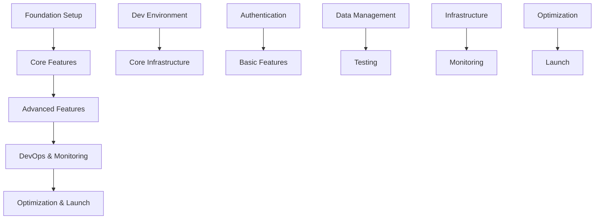

# Project Implementation Plan

## Phase 1: Foundation Setup (Weeks 1-2)

### 1. Development Environment

1. Repository Setup

   - [ ] Initialize Git repository
   - [ ] Configure Git hooks for commit standards
   - [ ] Set up branch protection rules
   - [ ] Configure CI/CD pipeline basics

2. Development Tools
   - [ ] Set up TypeScript configuration
   - [ ] Configure ESLint and Prettier
   - [ ] Set up testing framework (Jest)
   - [ ] Configure build tools
   - [ ] Set up Docker development environment

### 2. Core Infrastructure

1. Backend Foundation

   - [ ] Set up Express.js with TypeScript
   - [ ] Configure database connection (PostgreSQL)
   - [ ] Implement basic error handling
   - [ ] Set up logging infrastructure
   - [ ] Configure basic security middleware

2. Frontend Foundation
   - [ ] Create React application with TypeScript
   - [ ] Set up routing infrastructure
   - [ ] Configure state management foundation
   - [ ] Set up styling system
   - [ ] Implement basic component library structure

## Phase 2: Core Features (Weeks 3-4)

### 1. Authentication System

1. Backend Implementation

   - [ ] User model and migrations
   - [ ] Authentication endpoints
   - [ ] JWT implementation
   - [ ] Password hashing
   - [ ] Email verification system

2. Frontend Implementation
   - [ ] Login/Register forms
   - [ ] Authentication state management
   - [ ] Protected routes
   - [ ] User session handling
   - [ ] Password reset flow

### 2. Basic Features

1. User Management

   - [ ] User CRUD operations
   - [ ] Profile management
   - [ ] Role-based access control
   - [ ] User settings

2. Core UI Components
   - [ ] Design system implementation
   - [ ] Form components
   - [ ] Data display components
   - [ ] Navigation components
   - [ ] Layout components

## Phase 3: Advanced Features (Weeks 5-6)

### 1. Data Management

1. API Development

   - [ ] RESTful API endpoints
   - [ ] Request validation
   - [ ] Response formatting
   - [ ] API documentation
   - [ ] Rate limiting

2. State Management
   - [ ] Redux/Context implementation
   - [ ] Data caching strategy
   - [ ] Offline support
   - [ ] Real-time updates

### 2. Testing Implementation

1. Test Infrastructure

   - [ ] Unit testing setup
   - [ ] Integration testing setup
   - [ ] E2E testing setup
   - [ ] Test data management
   - [ ] CI test automation

2. Test Coverage
   - [ ] Core functionality tests
   - [ ] API endpoint tests
   - [ ] UI component tests
   - [ ] Integration tests
   - [ ] Performance tests

## Phase 4: DevOps & Monitoring (Weeks 7-8)

### 1. Infrastructure Setup

1. Cloud Infrastructure

   - [ ] AWS/Cloud infrastructure setup
   - [ ] Container orchestration
   - [ ] Database clustering
   - [ ] CDN configuration
   - [ ] SSL/TLS setup

2. CI/CD Pipeline
   - [ ] Automated testing
   - [ ] Build optimization
   - [ ] Deployment automation
   - [ ] Environment management
   - [ ] Release management

### 2. Monitoring & Observability

1. Monitoring Setup

   - [ ] Application monitoring
   - [ ] Error tracking
   - [ ] Performance monitoring
   - [ ] User analytics
   - [ ] Security monitoring

2. Logging & Debugging
   - [ ] Centralized logging
   - [ ] Log analysis tools
   - [ ] Debugging tools
   - [ ] Alert system
   - [ ] Incident response plan

## Phase 5: Optimization & Launch (Weeks 9-10)

### 1. Performance Optimization

1. Frontend Optimization

   - [ ] Bundle optimization
   - [ ] Code splitting
   - [ ] Image optimization
   - [ ] Caching strategy
   - [ ] Load time optimization

2. Backend Optimization
   - [ ] Database optimization
   - [ ] API performance
   - [ ] Memory management
   - [ ] Query optimization
   - [ ] Caching implementation

### 2. Launch Preparation

1. Documentation

   - [ ] API documentation
   - [ ] User documentation
   - [ ] Development guides
   - [ ] Deployment guides
   - [ ] Maintenance procedures

2. Launch Tasks
   - [ ] Security audit
   - [ ] Performance testing
   - [ ] User acceptance testing
   - [ ] Backup procedures
   - [ ] Launch checklist

## Dependencies and Critical Path

## Risk Management

1. Technical Risks

   - Database performance issues
   - Integration complexities
   - Security vulnerabilities
   - Scalability challenges

2. Mitigation Strategies
   - Regular security audits
   - Performance monitoring
   - Load testing
   - Code reviews
   - Documentation maintenance

## Success Criteria

1. Technical Metrics

   - 95% test coverage
   - <500ms API response time
   - <3s page load time
   - Zero critical security issues

2. Business Metrics
   - User adoption rates
   - System uptime >99.9%
   - Error rate <1%
   - Customer satisfaction metrics
